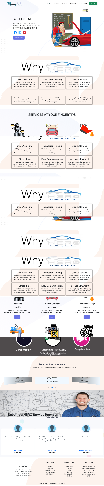

# <h2 align="center">Hero Auto Care</h2>

---

### A Full Stack Application about Auto Care & Service Provider

-

- [Live Website](https://hero-auto-service.web.app/ "Click For View Live Site")
- [Client Site Code](https://github.com/Abu-Sid/Hero-Auto "Click For View Clint Site Code")
- [Server Site Code](https://github.com/Abu-Sid/hero-auto-care-server "Click For View Server Site Code")

---

## Features

- A full-stack web application about an Auto care & service provider.
- A single page web application design by sass, and material UI.
- A User can explore the web app with services, location and contact information.
- Hassle-free Google Login/Registration.
- Integration with Stripe payment gateway.
- Implemented Role-based authentication (Admin and User)
- User can buy any service and leave a review if he/she is satisfied.
- Admin can Add/Delete a service and can also monitor/update a service status.
- Admin can add new admin using email.
- Fully Responsive.
- Image/ file upload with imageBB.

---

## Technology

- React JS
- Bootstrap
- Firebase Authentication
- React Router
- React Hook Form
- React Material UI
- React Dropdown
- React Stripe Payment
- Node SASS
- Axios
- React Spring
- Node JS
- Express Js
- Mongo DB for Database
- Heroku

---

:heart: Happy Coding :clap: 🚀
